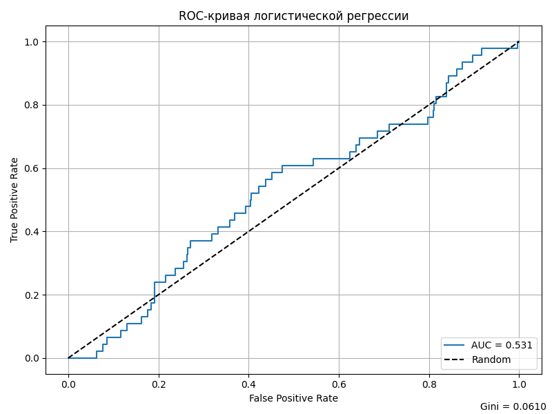

---

## 1. Результаты первого задания

* **Исходные файлы**:

  * `clients_data.csv`
  * `defaults_data.csv`

* **Как получены данные**:
  Для проведения теста были сгенерированы синтетические данные, имитирующие реальные таблицы бухгалтерской отчётности клиентов (таблица `clients`) и дефолтных событий (таблица `defaults`). Генерация производилась с учётом структуры исходного задания, реалистичных значений и дат. Случайным образом моделировались финансовые показатели и даты наступления дефолтов, чтобы обеспечить репрезентативную выборку.
  Генерация и сохранение данных реализована в Python и сохранена в `data/clients_data.csv` и `data/defaults_data.csv`.

* **SQL-скрипт**: `sql_script.sql`

* **Результат**: `final_data.csv`, содержащий три колонки:

  ```
  inn | reportdate | default_flag
  ```

  Каждая строка — наблюдение за клиентом на конкретную дату отчётности.
  `default_flag = 1` — «плохой» клиент (дефолт в течение 365 дней после отчёта).
  `default_flag = 0` — «хороший» клиент.

---

## 2. Подготовка данных для обучения (второе задание)

### Проблема

В `final_data.csv` нет финансовых признаков (`1110`, `1150`, `2110`), которые нужны для обучения модели.

### Решение

В файле `src/Data.py` реализована функция `prepare_training_dataset(clients_path, defaults_path)`, которая:

1. Загружает `clients_data.csv` и `defaults_data.csv`.

2. Определяет самый ранний дефолт по каждому клиенту до 09.09.2021.

3. Исключает отчёты, по которым не прошло 365 дней до отсечения.

4. Проставляет `default_flag` по логике из задания.

5. Оставляет только одну запись с дефолтом на клиента.

6. Возвращает датафрейм со следующими колонками:

   ```
   inn, reportdate, 1110, 1150, 2110, default_flag
   ```

7. Сохраняет результат в `data/processed_dataset.csv`.
---

## 3. Обучение модели и оценка (второе задание)

В файле `src/train_model.py` реализована следующая логика:

### Обучение логистической регрессии

```python
from sklearn.linear_model import LogisticRegression

model = LogisticRegression(solver='liblinear')
model.fit(X, y)
y_scores = model.predict_proba(X)[:, 1]
```

`solver='liblinear'` выбран как надёжный для малых и средних выборок. `predict_proba` возвращает вероятности дефолта (`PD`), что удобно для построения ROC-кривой.


### Сохранение результатов

* ROC-кривая сохраняется в `outputs/roc_curve.png`



### Посчитанные метрики после обучения модели

```
AUC: 0.5305
Gini (встроенный): 0.0610
Gini (собственный): 0.0610
```

---

## 4. Итоговые выводы

Модель едва лучше случайной (где auc = 0.5), требуются изменения.

> Значения Gini получены двумя способами и полностью совпадают. Это подтверждает корректность расчётов.

**Интерпретация**:
Модель логистической регрессии на базовых финансовых признаках показывает слабую предсказательную силу. Для улучшения качества можно:

* Добавить больше признаков: коэффициенты ликвидности, рентабельности, тренды;
* Провести регуляризацию и отбор признаков (например, через L1);
* Протестировать более сложные алгоритмы: градиентный бустинг, случайный лес.

---

## 5. Инструкция по запуску проекта

```bash
# Подготовка данных
python src/Data.py

# Обучение модели и генерация отчётов
python src/train_model.py
```
